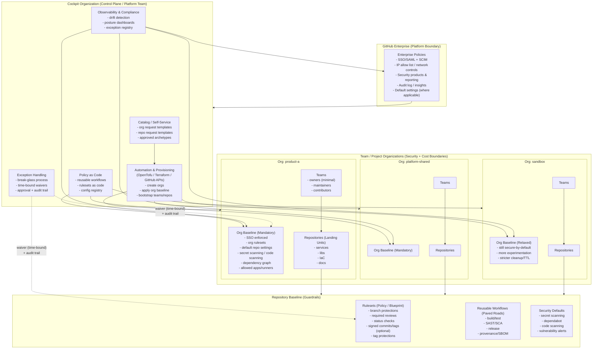

# Mental Model

A landing zone is a **platform operating model** with guardrails and paved roads.
In Azure, the Landing Zone concept exists because *scale breaks informal governance*.

GitHub Enterprise has the same problem: once you cross a certain number of repositories and teams, you get:

- inconsistent protection rules
- insecure workflows and token sprawl
- duplicated YAML and random CI patterns
- unclear ownership and exception chaos
- “we can’t audit it” moments

The GitHub Enterprise Landing Zone is how you prevent that.

## Overview

## The mapping

We reuse Azure Landing Zone thinking because it gives a clean hierarchy of boundaries.

| Azure Landing Zone | GitHub Enterprise Landing Zone | Why it matters |
| --- | ---| --- |
| Tenant / Mgmt Group | GitHub Enterprise | Top-level platform boundary (identity, audit, governance) |
| Subscription | GitHub Organization | **Security + cost boundary**; separation of duties; blast radius control |
| Resource Group | Repository | **Landing unit**: baseline controls, CI standards, lifecycle |
| Policy / Blueprint | Rulesets & Reusable Workflows | Enforced guardrails + paved road automation |

### Key interpretation
- **Enterprise** is the platform surface: identity, audit, governance primitives.
- **Organization** is where you enforce boundaries (who can do what, where, and how).
- **Repository** is where developers live — so guardrails must be automatic and default.

## What breaks at scale (and how this model prevents it)

### 1) “Every repo is unique”
**Symptom:** teams copy workflows, protections drift, security posture is unknown.

**Fix:** repositories get a baseline through:

- rulesets (branch protections, required checks)
- reusable workflows (standard build/test/scan)
- a defined exception path (documented, time-bound, reviewed)

### 2) “One org to rule them all”
**Symptom:** permission sprawl, audit complexity, blast radius is huge, billing is opaque.

**Fix:** treat organizations as:

- product/portfolio boundaries (or regulatory boundaries)
- ownership boundaries (platform vs product responsibility)
- cost/billing boundaries (chargeback/showback)
- containment boundaries (incidents and mistakes don’t propagate)

### 3) “Security is a ticket queue”
**Symptom:** platform team becomes gatekeeper; developers circumvent controls.

**Fix:** security-by-default with self-service:

- guardrails are enforced automatically
- paved roads are the easiest path
- opt-out exists but is explicit and measurable

## Design principles (opinionated defaults)

1. **Governance first, automation second**  
   Automate the policy you can explain and defend.

2. **Secure by default, opt-out only when justified**  
   Exceptions are part of the model, not a failure of it.

3. **Scale matters more than convenience**  
   Small shortcuts turn into massive drift at 500+ repos.

4. **Avoid YAML copy/paste anti-patterns**  
   Reusable workflows are the platform API.

5. **Platform enables, it doesn’t gatekeep**  
   The goal is paved roads, not approvals.

## What “baseline” means in this project

A baseline is the minimum set of controls and conventions that make a repo:

- safe to merge to default branch
- observable (status checks, logs, evidence)
- consistent to build and deploy
- auditable with low effort

Baselines should be:

- opinionated
- configurable
- versioned over time
- measurable (you can report compliance)

---

Next: define boundaries with [Organization strategy](org-strategy.md)
