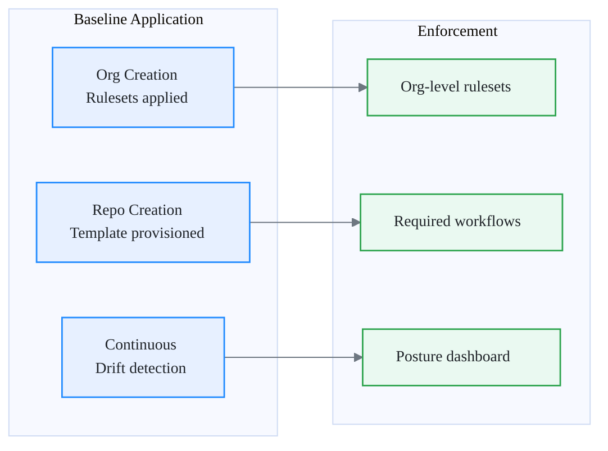

# Repository Baseline

Every repository is a **landing unit**. It is not just a code container — it is a security surface, a compliance scope, and an operational boundary. Before a single line of code is merged, the repo must meet a minimum standard that makes it safe, observable, consistent, and auditable.

This page defines what that standard is, how it is enforced, and how you measure it.

## What the baseline includes

The baseline is organized into four control categories. Together they ensure that every repo — regardless of language, team, or lifecycle stage — behaves predictably from day one.

### Branch protection

- Default branch is protected (no direct push, no force push, no deletion)
- Pull requests are required for all changes to the default branch
- At least one approval is required before merge
- Status checks must pass before merge
- Conversation resolution is required

### Security features

- Secret scanning is enabled with push protection
- Dependabot alerts are enabled
- Dependabot security updates are enabled
- Code scanning is configured (via reusable workflow or default setup)

### CI requirements

- A CI workflow runs on every pull request targeting the default branch
- The CI workflow is a reusable workflow from the platform org (not a local copy)
- Build and test steps produce artifacts or evidence (logs, reports)

### Metadata and labeling

- Repository has a description
- Repository has topics that identify the owning team, technology stack, and environment tier
- A `CODEOWNERS` file exists and maps to active teams
- License and visibility are explicitly set (not inherited by accident)

## Mandatory vs configurable

Not every control works the same way for every team. Some are non-negotiable. Others allow bounded flexibility.

| Control | Type | Detail |
| --- | --- | --- |
| Default branch protection (no direct push, no force push) | **Mandatory** | Applied via org-level ruleset. Cannot be overridden. |
| Secret scanning with push protection | **Mandatory** | Enabled at enterprise level. No opt-out. |
| Dependabot alerts | **Mandatory** | Enabled at enterprise level. No opt-out. |
| Code scanning | **Mandatory** | Default setup or reusable workflow. Must produce results. |
| Required reviewers count | Configurable | Minimum 1, default 2. Teams may adjust within bounds. |
| CI workflow choice | Configurable | Must be a reusable workflow. Teams pick from the catalog. |
| Topic labels | Configurable | Must include team and stack. Additional topics are optional. |
| `CODEOWNERS` mapping | Configurable | Structure is enforced. Team assignments are team-owned. |
| Merge strategy (squash, merge, rebase) | Configurable | Team chooses. Platform does not enforce a single strategy. |

!!! warning
    "Configurable" does not mean "optional". Configurable controls must still be set. The team chooses the value within defined bounds — they do not choose whether the control exists.

## How baselines are applied

Baselines are not a checklist you run once. They are applied continuously through three mechanisms.

### At org creation — rulesets

When a new organization is provisioned, the cockpit automation applies **org-level rulesets** that enforce mandatory controls on all repositories. These rulesets are the first line of defense and cannot be removed by org members.

### At repo creation — templates

New repositories are created from **approved templates** that include the correct CI workflow references, `CODEOWNERS` structure, default labels, and metadata. Templates ensure that repos start compliant instead of drifting into compliance later.

### Continuously — enforcement automation

A scheduled workflow in the cockpit org scans all repositories for baseline drift. It checks that rulesets are still applied, security features are still enabled, and metadata is still present. Drift is reported to the observability dashboard and triggers remediation alerts.

!!! tip
    Treat baseline enforcement like infrastructure drift detection. If a control disappears, the system should detect it and alert — not wait for the next audit.

## Baseline checklist

Use this checklist to validate that a repository meets the baseline. This is useful during onboarding reviews or periodic compliance sweeps.

### Branch protection

- [ ] Default branch is protected via org-level ruleset
- [ ] Direct push to default branch is blocked
- [ ] Force push to default branch is blocked
- [ ] Pull requests require at least one approval
- [ ] Status checks are required before merge

### Security

- [ ] Secret scanning is enabled with push protection
- [ ] Dependabot alerts are enabled
- [ ] Dependabot security updates are enabled
- [ ] Code scanning is configured and producing results

### CI

- [ ] CI workflow runs on pull requests to default branch
- [ ] CI workflow references a reusable workflow from the platform org
- [ ] CI produces build artifacts or evidence

### Metadata

- [ ] Repository has a description
- [ ] Repository has topics (team, stack, tier at minimum)
- [ ] `CODEOWNERS` file exists and maps to active teams
- [ ] License is explicitly set
- [ ] Visibility is explicitly set (public, internal, or private)

## Measuring compliance

A baseline only works if you can measure adherence across hundreds of repositories and multiple organizations.

### What to measure

| Metric | Source | Frequency |
| --- | --- | --- |
| Repos with all mandatory controls active | GitHub API + ruleset audit | Daily |
| Repos missing `CODEOWNERS` | GitHub API scan | Daily |
| Repos with secret scanning disabled | Enterprise security overview | Daily |
| Repos with no CI workflow on default branch | Workflow run history | Weekly |
| Repos with stale Dependabot alerts (>30 days) | Dependabot API | Weekly |
| Baseline drift events (control removed or changed) | Cockpit enforcement logs | Real-time |

### How to report

- The cockpit org publishes a **posture dashboard** (built from API data) showing per-org and per-repo compliance.
- Non-compliant repos are flagged with a **remediation deadline** (default: 14 days).
- Repos that remain non-compliant after the deadline trigger an **escalation** to the org owner and the platform team.

!!! note
    Compliance measurement is not about blame. It is about visibility. If 40% of repos are missing a control, the problem is the rollout process, not the teams.

---

Next: [Rulesets](rulesets.md)
