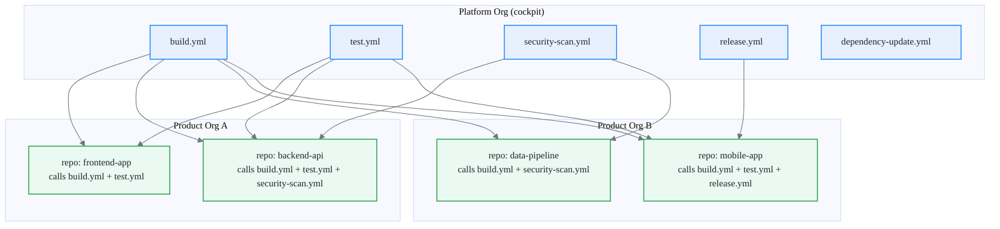

# Reusable Workflows

Reusable workflows are the **platform API**. They replace copy/paste YAML with centrally maintained, versioned, and secured workflow definitions that product teams consume as a service. If rulesets enforce *what* must happen, reusable workflows define *how* it happens.

Every team should call a reusable workflow — not write their own CI from scratch.

## Why reusable workflows

### Consistency

When 200 repositories each have their own build workflow, you get 200 variations. Some pin dependencies, some do not. Some run security scans, some skip them. Reusable workflows guarantee that every repo that calls the platform workflow gets the same steps, the same checks, and the same evidence.

### Maintainability

When a build tool changes or a security scanner needs a version bump, you update one workflow in one repository. Every consumer picks up the change on their next run (or at the next tagged version). Without reusable workflows, you file 200 pull requests.

### Security

Reusable workflows run in the **caller's context** but can access **secrets defined in the platform org**. This means:

- Product repos never need to store shared secrets (registry credentials, scan tokens).
- The platform team controls secret rotation in one place.
- Workflow code is reviewed and approved by the platform team before it runs anywhere.

!!! note
    Reusable workflows are called with `uses:`. They are not the same as composite actions. Composite actions run inline. Reusable workflows run as a separate job with their own runner context and secret scope.

## Architecture

The platform org publishes reusable workflows. Product orgs consume them by reference.



<details>
<summary>Text description of reusable workflows architecture diagram</summary>

The Platform Org (cockpit) contains five workflow files: build.yml, test.yml, security-scan.yml, release.yml, and dependency-update.yml. Two Product Orgs consume these workflows. Product Org A has frontend-app (calls build + test) and backend-api (calls build + test + security-scan). Product Org B has data-pipeline (calls build + security-scan) and mobile-app (calls build + test + release). Arrows show which workflows each repo consumes.

</details>

### How it works

1. The platform team maintains workflow files in the cockpit org under `.github/workflows/`.
2. Workflows are tagged with semantic versions (`v1`, `v1.2`, `v1.2.3`).
3. Product repos reference workflows using the full path: `uses: platform-org/workflows/.github/workflows/build.yml@v1`.
4. GitHub resolves the reference at runtime, pulls the workflow definition, and executes it in the caller's context.
5. Secrets needed by the workflow are stored in the platform org and passed through `secrets: inherit` or explicit secret inputs.

## Standard workflow catalog

Every platform org should publish at minimum these five workflows.

### build

Compiles the application, produces artifacts, and uploads them to the artifact store.

| Input | Type | Description |
| --- | --- | --- |
| `language` | string | Runtime/language (`node`, `java`, `dotnet`, `python`, `go`) |
| `language-version` | string | Version of the runtime |
| `artifact-name` | string | Name for the uploaded artifact |

### test

Runs unit and integration tests. Produces a test report.

| Input | Type | Description |
| --- | --- | --- |
| `language` | string | Runtime/language |
| `test-command` | string | Override for the test command (default: framework-specific) |
| `coverage-threshold` | number | Minimum coverage percentage (default: 80) |

### security-scan

Runs SAST, secret detection, and dependency vulnerability scanning. Uploads results to GitHub Code Scanning.

| Input | Type | Description |
| --- | --- | --- |
| `scan-type` | string | `sast`, `secrets`, `dependencies`, or `all` (default: `all`) |
| `fail-on-severity` | string | Minimum severity to fail the check (`critical`, `high`, `medium`) |

### release

Creates a GitHub release, tags the commit, builds and publishes the artifact to the registry.

| Input | Type | Description |
| --- | --- | --- |
| `version` | string | Semantic version for the release |
| `registry` | string | Target registry (e.g., `ghcr.io`, `npm`, `pypi`) |
| `sign` | boolean | Whether to sign the artifact (default: `true`) |

### dependency-update

Runs on a schedule. Opens pull requests for outdated dependencies using Dependabot or Renovate.

| Input | Type | Description |
| --- | --- | --- |
| `strategy` | string | `dependabot` or `renovate` (default: `dependabot`) |
| `schedule` | string | Cron expression or preset (`daily`, `weekly`) |

!!! tip
    The catalog is a starting point. Teams can request new workflows through the service catalog in the cockpit org. Every new workflow goes through the same review and versioning process.

## Versioning strategy

Workflow versioning follows the same principles as library versioning. Consumers must be able to trust that a pinned reference will not break their build.

### Tag structure

| Tag | Meaning | Example |
| --- | --- | --- |
| `v1` | Major version (floating). Points to the latest `v1.x.x`. | `uses: platform-org/workflows/.github/workflows/build.yml@v1` |
| `v1.2` | Minor version (floating). Points to the latest `v1.2.x`. | `uses: platform-org/workflows/.github/workflows/build.yml@v1.2` |
| `v1.2.3` | Exact version (pinned). Never moves. | `uses: platform-org/workflows/.github/workflows/build.yml@v1.2.3` |

### Breaking change policy

- **Major version bump** (`v1` to `v2`): breaking changes (renamed inputs, removed steps, changed behavior). Consumers must explicitly update their reference.
- **Minor version bump** (`v1.1` to `v1.2`): new features, new optional inputs. No breaking changes.
- **Patch version bump** (`v1.2.1` to `v1.2.2`): bug fixes, dependency updates. No behavior changes.

### Recommended pinning

- Use the **major version tag** (`@v1`) for most consumers. This gives you automatic minor and patch updates.
- Use the **exact version tag** (`@v1.2.3`) for regulated or sensitive repos that need full reproducibility.
- Never use `@main` or `@HEAD` in production workflows.

!!! warning
    Floating tags (`v1`, `v1.2`) are re-pointed when a new version is released. If you need absolute stability, pin to the exact version. If you need automatic security patches, use the major tag.

## Consuming a workflow

Here is how a product repository calls the platform build and test workflows.

```yaml
# .github/workflows/ci.yml in a product repo
name: CI

on:
  pull_request:
    branches: [main]
  push:
    branches: [main]

jobs:
  build:
    uses: platform-org/workflows/.github/workflows/build.yml@v1
    with:
      language: node
      language-version: "20"
      artifact-name: frontend-app
    secrets: inherit

  test:
    needs: build
    uses: platform-org/workflows/.github/workflows/test.yml@v1
    with:
      language: node
      coverage-threshold: 85
    secrets: inherit

  security-scan:
    uses: platform-org/workflows/.github/workflows/security-scan.yml@v1
    with:
      scan-type: all
      fail-on-severity: high
    secrets: inherit
```

The product team writes a short orchestration file. The platform team owns the implementation. This is the contract.

!!! note
    The `secrets: inherit` directive passes the caller's secrets to the reusable workflow. For platform-owned secrets (registry tokens, scan API keys), the reusable workflow accesses them from the platform org's secret store directly.

## Anti-patterns

These patterns undermine the value of reusable workflows. Avoid them.

### Forking workflows

**Problem:** A team copies the platform workflow into their own repo and modifies it locally.

**Why it breaks:** The fork drifts immediately. Security patches, new checks, and improvements in the platform workflow never reach the fork. Compliance reporting sees the local workflow but cannot verify it matches the standard.

**Fix:** If the platform workflow does not meet a team's needs, they should open an issue or pull request in the platform org. The workflow should be extended, not forked.

### Unpinned references

**Problem:** A workflow references `@main` or `@HEAD` instead of a version tag.

**Why it breaks:** Any push to the platform repo changes behavior in every consumer immediately. A broken commit in the platform repo breaks CI across the entire enterprise.

**Fix:** Always pin to a version tag. Use `@v1` for auto-updates within a major version. Use `@v1.2.3` for full reproducibility.

### Inline secrets

**Problem:** Secrets are hardcoded in the workflow file or stored in the product repo's settings.

**Why it breaks:** Secrets in product repos are harder to rotate, harder to audit, and more likely to leak. Every repo that stores the same registry credential is a separate attack surface.

**Fix:** Use `secrets: inherit` or explicit secret inputs. Store shared secrets in the platform org. Product repos should only store secrets that are unique to that repo.

### Skipping the catalog

**Problem:** A team writes a one-off workflow for a common task (e.g., Docker build, Terraform plan) instead of using the catalog.

**Why it breaks:** The one-off workflow is not reviewed, not versioned, and not maintained by the platform team. It becomes invisible to compliance reporting.

**Fix:** Check the workflow catalog first. If the task is common enough to be reused, it belongs in the catalog. If it is truly unique, document why in the repo.

---

Next: [Consume the framework](../how-to/consume-framework.md)
