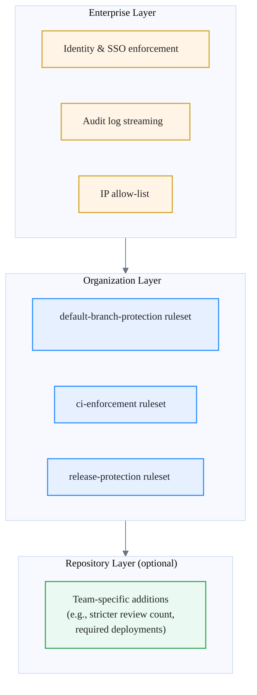
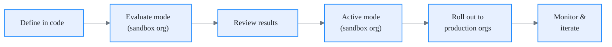

# Rulesets

Rulesets are the **enforcement mechanism** for guardrails at scale. They replace legacy branch protection rules with a layered, auditable, org-level system that can be applied consistently across hundreds of repositories without manual configuration.

If the [repository baseline](repo-baseline.md) defines *what* must be true, rulesets define *how* it is enforced.

## Why rulesets over branch protection rules

Legacy branch protection rules were designed for individual repositories. They work at small scale. They break at enterprise scale for several reasons:

| Capability | Branch Protection Rules | Rulesets |
| --- | --- | --- |
| Scope | Repo-level only | Org-level or repo-level |
| Stackable | No (one rule set per branch pattern) | Yes (multiple rulesets stack and merge) |
| Bypass with audit trail | No (admin override is silent) | Yes (bypass actors are explicit and logged) |
| Targeting | Branch name pattern per repo | Branch name pattern across all repos in the org |
| Enforcement mode | Active or off | Active, evaluate (dry-run), or disabled |
| API management at scale | Requires per-repo API calls | Single API call applies to all targeted repos |

!!! warning
    Branch protection rules still work, but they are a legacy mechanism. New guardrails should always use rulesets. Existing branch protection rules should be migrated to rulesets as part of baseline adoption.

The key advantage is **org-level enforcement**. A single ruleset defined at the org level applies automatically to every repository that matches the targeting criteria. Repo admins cannot remove it. This is the foundation of "secure by default."

## Ruleset design

Rulesets follow a layered model. Each layer adds controls, and layers stack — they do not override each other.

### Enterprise layer

Set at the GitHub Enterprise level. These are identity, audit, and network controls. They apply to every organization and every repository. Examples: SAML/SSO enforcement, audit log streaming, IP allow-lists.

### Organization layer

Set at the org level by the cockpit automation. These are the **mandatory guardrails** that apply to all repositories in the org. Org members cannot modify or remove them. This is where the baseline lives.

### Repository layer

Set at the repo level by the team that owns it. These are **additions** — teams can make things stricter but not weaker. For example, a team handling PCI data may require two reviewers instead of the org default of one.

!!! tip
    The layered model means you never need to copy rulesets across repos. Define once at the org level, override only where justified at the repo level.

## Recommended rulesets

Define these standard rulesets in every organization. They are applied by the cockpit automation at org creation and enforced continuously.

### default-branch-protection

Targets the default branch (`main` or `master`) across all repositories.

| Rule | Setting |
| --- | --- |
| Require pull request before merge | Enabled |
| Required approvals | 1 (configurable up to team preference) |
| Dismiss stale reviews on new push | Enabled |
| Require review from code owners | Enabled |
| Require status checks to pass | Enabled |
| Require branches to be up to date | Enabled |
| Block force pushes | Enabled |
| Block deletions | Enabled |
| Require linear history | Disabled (configurable per team) |

### release-protection

Targets release branches (`release/*`) and tags (`v*`).

| Rule | Setting |
| --- | --- |
| Require pull request before merge | Enabled |
| Required approvals | 2 |
| Block force pushes | Enabled |
| Block deletions | Enabled |
| Require signed commits | Enabled |
| Restrict tag creation to release automation | Enabled |

### ci-enforcement

Targets the default branch and all pull request branches.

| Rule | Setting |
| --- | --- |
| Require status checks to pass | Enabled |
| Required status checks | `build`, `test`, `security-scan` |
| Require workflows to pass | Platform reusable workflow reference |

### sensitive-repo-protection

Targets repositories with the `pci`, `sox`, or `hipaa` topic.

| Rule | Setting |
| --- | --- |
| Required approvals | 2 |
| Require signed commits | Enabled |
| Restrict who can push | Team leads and release automation only |
| Require deployments to succeed | Enabled (staging environment) |

!!! note
    The `sensitive-repo-protection` ruleset uses **repository property targeting** (topics). This lets you apply stricter controls to a subset of repos without per-repo configuration. Tag your repos correctly and the ruleset applies automatically.

## Bypass policies

Rulesets support explicit bypass actors. This is how you handle emergencies without disabling the ruleset.

### Who can bypass

| Actor | Condition | Audit |
| --- | --- | --- |
| Org owners | Emergency fixes only | Bypass logged in audit stream |
| Platform automation (service account) | Automated releases and provisioning | Bypass logged, scoped to specific workflows |
| Repository admins | **Cannot bypass org-level rulesets** | N/A |

### Bypass rules

1. **Bypass is always logged.** Every bypass event appears in the audit log stream with the actor, timestamp, repository, and branch.
2. **Bypass does not disable the ruleset.** It allows a single push or merge to proceed while the ruleset remains active for everyone else.
3. **Bypass should trigger a review.** The cockpit observability dashboard flags bypass events for weekly review by the platform team.
4. **Repeated bypass is a signal.** If the same team bypasses the same ruleset frequently, the ruleset may need adjustment — or the team needs support.

!!! warning
    Do not add large groups to the bypass list. Bypass actors should be individual org owners or tightly scoped service accounts. If "everyone" can bypass, the ruleset is decorative.

## Ruleset lifecycle

Rulesets are not static. They evolve as the platform matures and as GitHub ships new capabilities.

### Versioning

- Rulesets are defined as code in the cockpit org (Terraform/OpenTofu or GitHub API scripts).
- Each change is a pull request with review from the platform team.
- Ruleset definitions are tagged with a version (e.g., `rulesets-v1.2`).

### Rollout strategy

1. **Define** the ruleset in code and review with the platform team.
2. **Deploy in evaluate mode** to a sandbox org. Evaluate mode logs what the ruleset *would* enforce without blocking anything.
3. **Review evaluate-mode results** for false positives and unexpected impacts.
4. **Promote to active mode** in the sandbox org. Validate that teams can still merge, deploy, and release.
5. **Roll out to production orgs** one at a time, starting with the least critical.
6. **Monitor** bypass events and developer feedback for the first two weeks.

!!! tip
    Always use evaluate mode before activating a new ruleset. A ruleset that blocks every developer from merging on a Monday morning is worse than no ruleset at all.

### Testing changes

- Use a dedicated **sandbox org** that mirrors production org structure.
- Create test repositories with realistic branch patterns, workflows, and team permissions.
- Validate both the happy path (normal merge flow works) and the enforcement path (blocked actions are actually blocked).

---

Next: [Reusable workflows](reusable-workflows.md)
