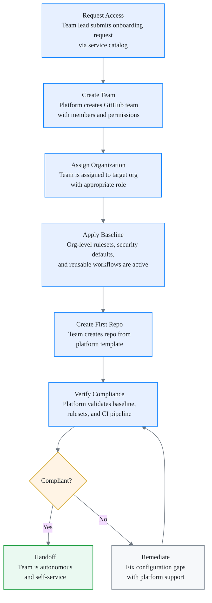

# Onboarding a Team

This is a step-by-step guide for bringing a new team into the GitHub Enterprise Delivery Zone. By the end of this process, the team will have an organization assignment, a GitHub team with correct permissions, a first repository created from a platform template, and verified compliance with all baseline controls.

Onboarding is a **platform responsibility** with team cooperation. The platform team provisions infrastructure and guardrails; the product team provides information and validates the result.

## Before you start

Complete this checklist before initiating the onboarding workflow:

- [ ] A **team lead** has been identified and will be the primary contact throughout onboarding
- [ ] The target **organization** has been decided (existing org or new org request)
- [ ] **Access requests** have been submitted for all team members (GitHub Enterprise SSO enrollment)
- [ ] The team lead understands the [guardrails](../guardrails/policies.md) that will be applied
- [ ] The team has reviewed [How to consume the framework](consume-framework.md)
- [ ] A **team name** has been chosen following the naming convention (e.g., `team-<product>-<function>`)

!!! note
    If you are onboarding into a new organization (not an existing one), the organization provisioning must be completed first. This is a separate request handled by the platform team through the service catalog.

## Onboarding workflow

The following diagram shows the end-to-end onboarding flow from initial request through to team autonomy.

## Step 1 — Request team creation

The team lead initiates the onboarding by submitting a request through the service catalog (or the designated issue template in the Cockpit organization).

The request must include:

- **Team name** — following the naming convention (e.g., `team-payments-backend`)
- **Team members** — GitHub usernames of all initial members
- **Target organization** — which org the team will operate in
- **Team purpose** — a short description of what the team builds and owns
- **Permission level** — typically `write` for product teams; `maintain` or `admin` require justification
- **Repositories needed** — number and type of initial repositories (service, library, infrastructure)

!!! tip
    Batch your initial team members in the request. Adding members later is possible but requires a separate request. Starting with a complete list avoids unnecessary back-and-forth.

The platform team reviews the request, validates naming and org assignment, and proceeds to provisioning.

## Step 2 — Team setup

Once the request is approved, the platform team provisions the following:

**GitHub team creation:**

- A GitHub team is created in the target organization with the requested name
- Team visibility is set according to organization policy (typically `visible` for internal collaboration)
- The team lead is added as a **team maintainer**
- All listed members are added with **member** role

**Permission assignment:**

- The team is granted the requested permission level on designated repositories
- Organization-level roles are assigned (member access to org-level resources)
- If the team needs access to shared repositories in other organizations, cross-org team sync is configured

**Notification:**

- The team lead receives confirmation with: team URL, org URL, list of applied baselines, and links to documentation

!!! warning
    Do not manually add members to the organization outside of the team provisioning process. Direct org invites bypass team-level permission controls and create unauditable access patterns.

## Step 3 — First repository

With the team in place, create your first repository to validate that everything works end to end.

1. Navigate to your organization and create a new repository from a **platform template** (see [Consume the framework — Step 1](consume-framework.md#step-1-use-repository-templates))
2. Verify the repository was created with the correct baseline:
    - [ ] Branch protection ruleset is active on the default branch
    - [ ] Required status checks are configured
    - [ ] Secret scanning is enabled
    - [ ] Dependabot is enabled
    - [ ] Code scanning (CodeQL) is configured
3. Add a `.github/workflows/ci.yml` that references the platform reusable workflows (see [Consume the framework — Step 2](consume-framework.md#step-2-consume-reusable-workflows))
4. Open a pull request to validate that:
    - [ ] Required checks run and pass
    - [ ] Review requirements are enforced
    - [ ] The merge process follows the expected linear history model

!!! tip
    The first pull request is your smoke test. If any check fails or a ruleset is not applied, flag it to the platform team immediately. It is much easier to fix configuration issues on the first repository than after the team has created ten.

## Step 4 — Verify and handoff

The platform team runs a compliance check on the newly created repository and team configuration.

**Compliance verification includes:**

- Organization-level rulesets are inherited and active
- Repository-level security features are enabled (not overridden)
- CI pipeline references platform reusable workflows (not local copies)
- Team permissions match the approved request
- No direct collaborator access exists outside of teams

Once verification passes, the team is formally handed off:

- [ ] The team lead acknowledges the baseline controls and ongoing responsibilities
- [ ] The platform team closes the onboarding request
- [ ] The team is added to the compliance dashboard for ongoing monitoring

## Ongoing responsibilities

After onboarding, the team is **autonomous within the guardrails**. Here is what the team owns going forward:

**Repository maintenance:**

- Creating new repositories from platform templates
- Keeping CI workflows up to date with platform reusable workflow versions
- Managing repository-level settings that are not controlled by rulesets (topics, description, visibility changes)

**Workflow updates:**

- Updating reusable workflow version pins when the platform team releases new major versions
- Adding project-specific CI jobs alongside platform workflows
- Testing workflow changes in pull requests before merging

**Exception management:**

- Requesting exceptions through the formal process when baseline controls conflict with legitimate needs
- Tracking exception expiry dates and renewing or resolving before they lapse
- Documenting why exceptions were needed for future reference

**Team membership:**

- Requesting member additions and removals through the service catalog
- Maintaining team maintainer assignments (at least one maintainer at all times)
- Reviewing team access quarterly as part of access governance

!!! warning
    The platform team monitors compliance continuously. If a repository drifts from the baseline (e.g., a required workflow is removed or a ruleset is bypassed), the team lead will be notified and expected to remediate within the defined SLA.

---

Next: [ADR 0001 — Documentation stack](../adr/0001-docs-stack.md)
