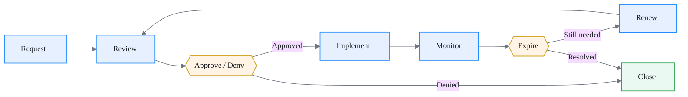

# Exception Process

Exceptions are part of the model, not a failure of it.
A well-governed platform does not pretend every team can follow every guardrail at all times.
It acknowledges deviations, documents them, bounds them in time, and tracks them to closure.
If your exception process is painful enough to avoid, it is working. If it is painful enough to circumvent, it is broken.

## What is an exception

An exception is a **time-bound, approved deviation from a mandatory guardrail**.

Guardrails in this framework (rulesets, reusable workflows, baseline controls) are enforced by default.
When a team cannot comply with a specific guardrail -- due to technical constraints, migration timelines, or legacy dependencies -- they request an exception instead of silently bypassing the control.

An exception is not:

- a permanent opt-out
- a feature request disguised as a waiver
- a way to avoid the platform team's paved roads indefinitely
- an approval to ignore security requirements

!!! note "Exceptions vs. configuration"
    If a guardrail supports a configuration option (e.g., choosing between two approved scanning tools), that is not an exception. Exceptions apply only when a mandatory control is being bypassed entirely.

## Exception lifecycle

Every exception follows the same lifecycle. No shortcuts, no special cases.

**Request:** The Product Team Lead submits a formal exception request through the service catalog.

**Review:** The Platform Team validates the technical details. Security and Compliance assesses the risk.

**Approve or Deny:** The approval authority (see below) makes a binding decision with documented rationale.

**Implement:** The Platform Team configures the waiver in the exception registry. The guardrail is relaxed for the defined scope only.

**Monitor:** The exception is visible in observability dashboards. Drift detection continues; the waiver does not suppress alerts -- it annotates them.

**Expire:** Every exception has an expiry date. When it expires, the guardrail is re-enforced automatically.

**Renew:** If the exception is still needed, the requesting team submits a renewal. Renewal goes through the full review cycle again -- no rubber stamps.

**Close:** The exception is closed when the guardrail is re-enforced (either by expiry or by the team resolving the underlying issue).

## Request requirements

Every exception request must include the following. Incomplete requests are rejected without review.

| Field | Description |
| --- | --- |
| **Scope** | Which guardrail is being bypassed, and in which repositories or organizations. |
| **Justification** | Why the guardrail cannot be met today. "It's inconvenient" is not a justification. |
| **Risk assessment** | What is the security, compliance, or operational risk of granting this exception. |
| **Duration** | How long the exception is needed. Maximum duration is 90 days; longer periods require executive sponsor approval. |
| **Remediation plan** | What the team will do to eliminate the need for the exception. Include milestones and an owner. |
| **Requestor** | The Product Team Lead or Org Owner submitting the request. |
| **Sponsoring org** | The organization affected by the exception. |

!!! tip "Template"
    The Platform Team should publish an exception request template in the service catalog. Pre-filled fields reduce friction and improve consistency.

## Approval authority

Not all exceptions carry the same risk. The approval authority depends on what is being bypassed.

| Exception type | Approver | Consulted |
| --- | --- | --- |
| Ruleset bypass (branch protection, required checks) | Org Owner | Platform Team |
| Reusable workflow opt-out | Platform Team | Security and Compliance |
| Secret scanning or code scanning exemption | Security and Compliance | Platform Team, Org Owner |
| Dependency review bypass | Security and Compliance | Platform Team |
| Cross-org access exception | Enterprise Admin | Platform Team, Security and Compliance |
| Audit log or compliance control exemption | Security and Compliance + Enterprise Admin | Platform Team |

!!! warning "No self-approval"
    The team requesting an exception cannot approve it. Approval must come from a role with oversight authority over the affected guardrail.

## Time-bound enforcement

Every exception has an expiry date. There are no permanent exceptions in this model.

**Default maximum duration:** 90 days.

**Renewal rules:**

- [ ] Renewal requires a new request with updated justification
- [ ] The remediation plan must show progress since the original request
- [ ] If no progress has been made, the renewal is denied unless an executive sponsor intervenes
- [ ] Consecutive renewals (3+) trigger an escalation to Security and Compliance for architectural review

**Automatic re-enforcement:** When an exception expires, the Platform Team's automation re-applies the guardrail. The requesting team is notified 14 days and 3 days before expiry.

!!! note "Why 90 days"
    90 days is long enough to cover a sprint cycle or migration phase, but short enough to force a regular re-evaluation. If a team needs more than 90 days, the underlying issue is likely architectural and should be addressed as a project, not a series of renewals.

## Exception registry

All exceptions are tracked in the exception registry, maintained in the Cockpit Organization. The registry is the single source of truth for active, expired, and denied exceptions.

### Required fields

| Field | Description |
| --- | --- |
| Exception ID | Unique identifier (auto-generated). |
| Status | Active, Expired, Denied, Renewed, Closed. |
| Guardrail | The specific guardrail being bypassed. |
| Scope | Repositories and/or organizations affected. |
| Requestor | Who submitted the request. |
| Approver | Who approved (or denied) the request. |
| Approval date | When the decision was made. |
| Expiry date | When the exception automatically expires. |
| Justification | Summary of why the exception was granted. |
| Risk level | Low, Medium, High, Critical. |
| Remediation plan | Link to the plan and milestones. |
| Renewal history | List of previous renewals, if any. |

### Access and visibility

- The registry is **readable** by all Org Owners, Product Team Leads, and Security and Compliance.
- The registry is **writable** by the Platform Team (who maintain the automation) and the approval authority.
- Exception data feeds into observability dashboards so that compliance posture is always visible.
- Audit exports are available for external compliance reviews.

!!! tip "Automate the registry"
    Use a GitHub repository in the Cockpit Organization with issues or a structured YAML/JSON file tracked in version control. Every change to the registry should produce a commit with a clear audit trail.

## Anti-patterns

### Permanent exceptions

An exception without an expiry date is not an exception -- it is an undocumented policy change. If a guardrail does not apply to a class of repositories, update the guardrail definition instead of granting perpetual waivers.

**Fix:** enforce expiry dates in automation. The registry should not accept an entry without an expiry field.

### Verbal approvals

"I talked to the security lead and they said it was fine" is not an approval. If it is not in the registry, it does not exist.

**Fix:** all approvals must be recorded in the exception registry with the approver's identity and timestamp.

### Scope creep

An exception granted for one repository quietly expanding to cover an entire organization. This happens when exception scope is vague or when teams copy exception configurations.

**Fix:** scope must be explicit (list of repositories or organizations). The Platform Team's automation should enforce scope boundaries and alert on unauthorized expansion.

### Exception as feature request

Teams submitting exceptions because the guardrail does not support their use case, when the real need is a guardrail enhancement. This clogs the exception process and leaves the root cause unaddressed.

**Fix:** if multiple teams request exceptions for the same guardrail, treat it as a signal to improve the guardrail. The Platform Team should track exception frequency per guardrail and prioritize enhancements accordingly.

### Rubber-stamp renewals

Renewing exceptions without reviewing whether the remediation plan has progressed. This turns time-bound waivers into permanent ones with extra paperwork.

**Fix:** renewals require evidence of progress. The approval authority must verify that the remediation plan milestones are on track before approving a renewal.

---

Next: [Repository baseline](../guardrails/repo-baseline.md)
